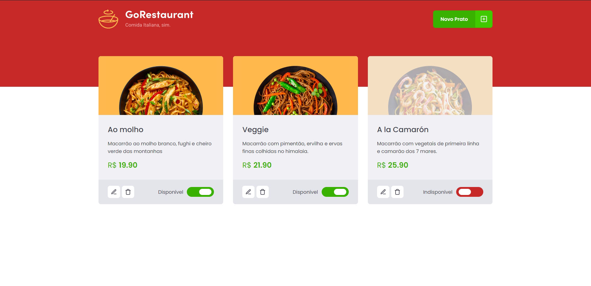
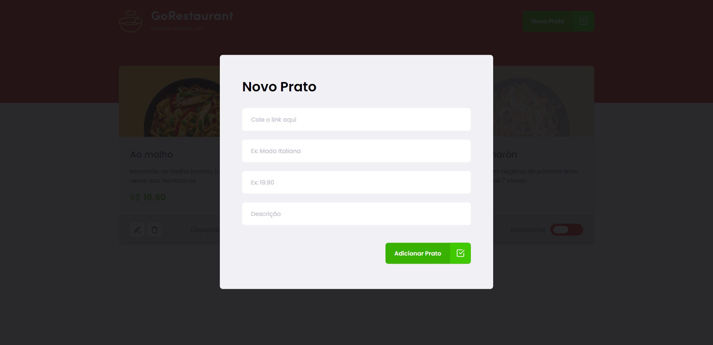
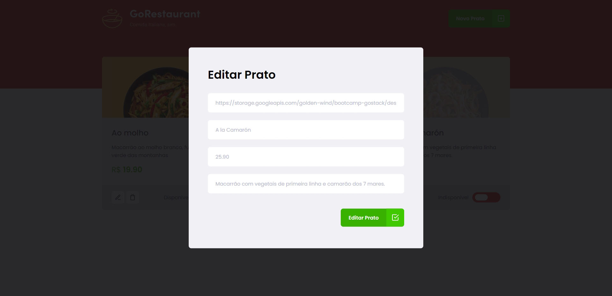

<h1 align="center">
     
</h1>

<p align="center">  
 GoRestaurant é uma aplicação que é usada em um dos desafios do segundo modulo do Ignite da <a href="https://rocketseat.com.br/">Rocketseat</a>
</p>

<h4 align="center">
	🚧 Concluído 🚀 🚧
</h4>

Tabela de conteúdos
=================
<!--ts-->
   * [Sobre o projeto](#-sobre-o-projeto)
   * [Layout](#-layout)
     * [Veja a aplicação funcionando](#veja-a-aplicação-funcionando)
     * [Web](#web)
   * [Como executar o projeto](#-como-executar-o-projeto)
   * [Tecnologias](#-tecnologias)
   * [Licença](#user-content--licença)
<!--te-->


## 💻 Sobre o projeto

<p>O projeto é uma aplicação onde podemos adicionar novos pratos, editar ou remover eles e também deixar os pratos disponíveis ou não.</p>
<p>O principal objetivo é realizar dois processos de migração: de Javascript para Typescript e de Class Components para Function Components.</p>
<p><a href="https://github.com/Tuhh16/ignite-template-reactjs-refactoring-classes-ts">Clique aqui</a> para o mesmo projeto usando Javascript e Class Components</p>

## 🎨 Layout

### Veja a aplicação funcionando

<p align="center" style="display: flex; align-items: flex-start; justify-content: center;">
  
</p>

### Web

<p align="center" style="display: flex; align-items: flex-start; justify-content: center;">
  
  
  
</p>

## 🚀 Como executar o projeto

Para executar esse projeto, você deve abrir 2 terminais um para iniciar a aplicação e outro o JSON Server.

### Pré-requisitos

Antes de começar, você vai precisar ter instalado em sua máquina as seguintes ferramentas:
[Git](https://git-scm.com), [Node.js](https://nodejs.org/en/). 
Além disto é bom ter um editor para trabalhar com o código como [VSCode](https://code.visualstudio.com/)

#### Rodando a aplicação web (Frontend)

```bash

# Clone este repositório
$ git clone https://github.com/Tuhh16/ignite-template-reactjs-refactoring-function-ts.git

# Acesse a pasta do projeto no seu terminal/cmd
$ cd ignite-template-reactjs-refactoring-function-ts

# Instale as dependências
$ yarn install

# Execute a aplicação em modo de desenvolvimento
$ yarn start

# A aplicação será aberta na porta:3000 - acesse http://localhost:3000

# Para iniciar o backend basta iniciar o json server seguindo os seguintes passos

# Acesse a pasta do projeto no seu terminal/cmd
$ cd ignite-template-reactjs-refactoring-function-ts

# Execute a aplicação em modo de desenvolvimento
$ yarn server

# A aplicação será aberta na porta:3333 - acesse http://localhost:3333

```

---

## 🛠 Tecnologias

As seguintes ferramentas foram usadas na construção do projeto:

-   **[ReactJs](https://pt-br.reactjs.org/)**
-   **[TypeScript](https://www.typescriptlang.org/)**

> Veja o arquivo  [package.json](https://github.com/Tuhh16/ignite-template-reactjs-refactoring-function-ts/blob/master/package.json)

---

## 📝 Licença

Este projeto esta sobe a licença [MIT](./LICENSE).

Feito por Arthur Teodoro Alves de Lima 👋🏽 [Entre em contato!](https://www.linkedin.com/in/arthur-lima-reactjs/)
